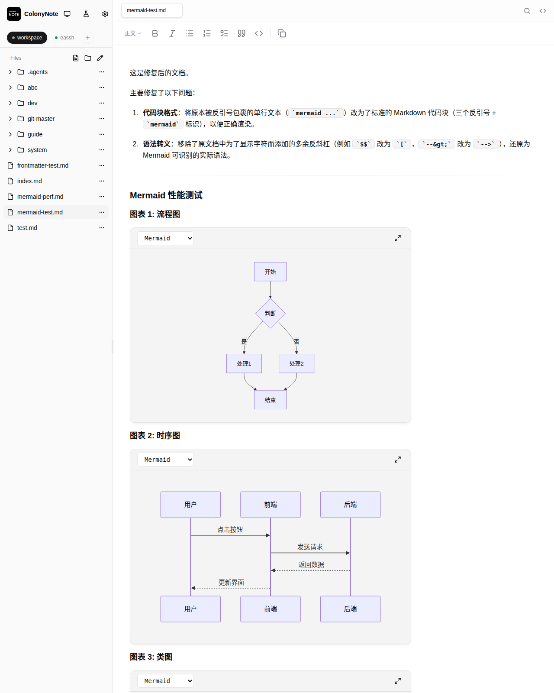
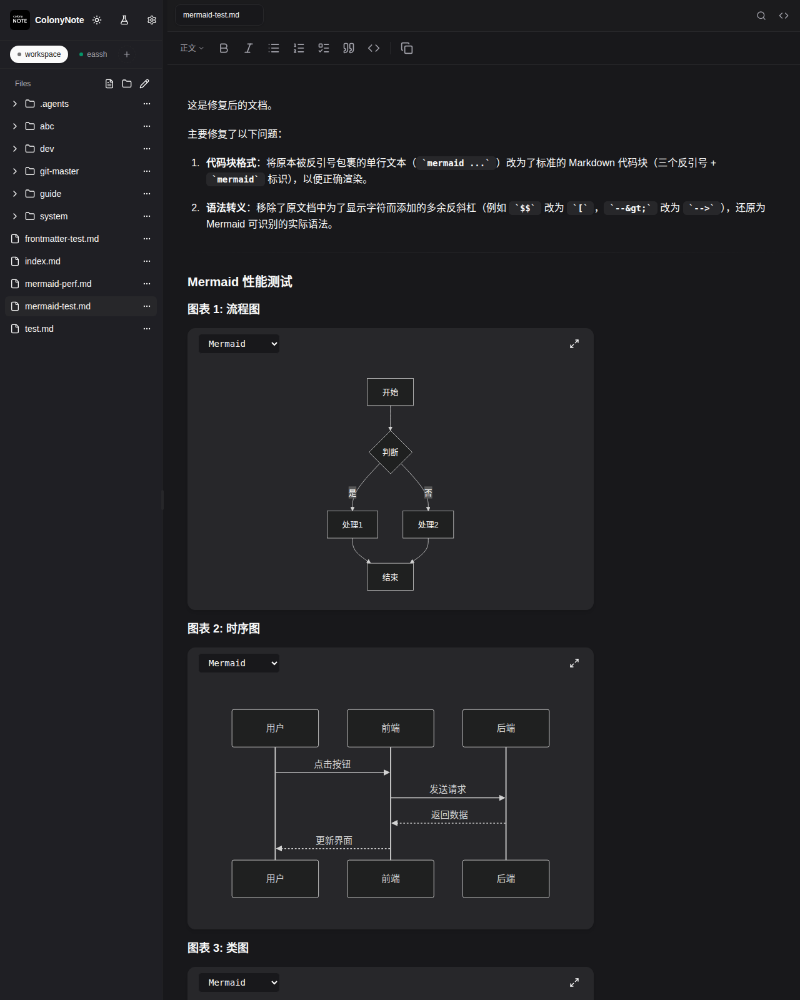
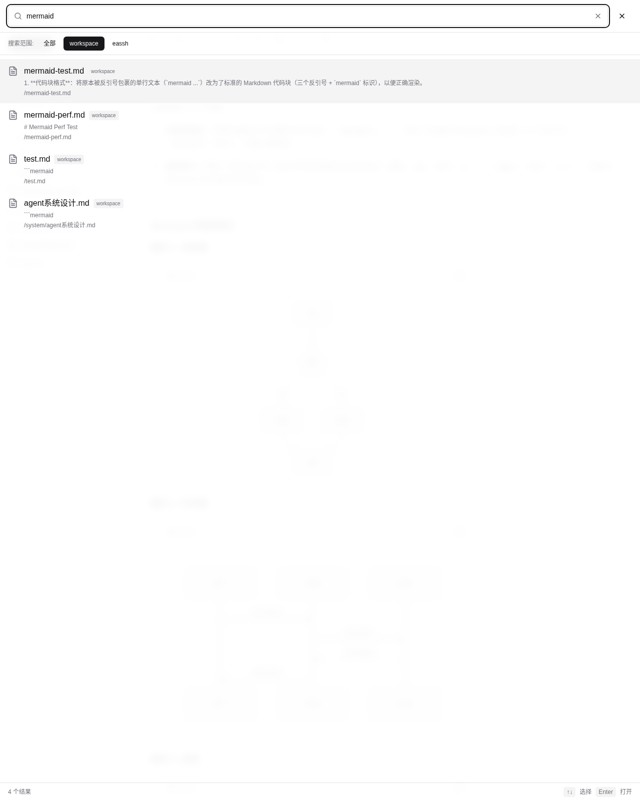
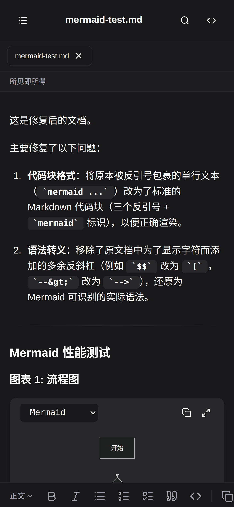

# ColonyNote

**A modern Markdown online editor with real-time preview.**

Edit server-side Markdown files directly in your browser — no upload, no download, just open and write.

[简体中文](README.zh.md) · English

---

## Screenshots

<table style="min-width: 50px;">
<colgroup><col style="min-width: 25px;"><col style="min-width: 25px;"></colgroup><tbody><tr><td colspan="1" rowspan="1"></td><td colspan="1" rowspan="1"></td></tr><tr><td colspan="1" rowspan="1" style="text-align: center;"><p>Light Theme</p></td><td colspan="1" rowspan="1" style="text-align: center;"><p>Dark Theme</p></td></tr><tr><td colspan="1" rowspan="1"></td><td colspan="1" rowspan="1"></td></tr><tr><td colspan="1" rowspan="1" style="text-align: center;"><p>Full-text Search</p></td><td colspan="1" rowspan="1" style="text-align: center;"><p>Mobile Editor</p></td></tr></tbody>
</table>

## Features

- **Server-side Editing** — Edit Markdown files on your server directly in the browser. No file upload or download needed.
- **WYSIWYG + Source Mode** — Switch between rich text editing and raw Markdown source with one click.
- **Real-time Preview** — Live rendering as you type, powered by TipTap 3.
- **Mermaid Diagrams** — Render flowcharts, sequence diagrams, class diagrams, state diagrams, ER diagrams, Gantt charts, pie charts, and user journey maps.
- **LaTeX Math** — Full support for mathematical expressions via KaTeX.
- **Code Highlighting** — Syntax highlighting for 15+ programming languages with copy-to-clipboard.
- **Full-text Search** — Search across all your documents with ripgrep-powered fuzzy matching.
- **Multi-directory Support** — Manage multiple document directories simultaneously, each with its own file tree.
- **Multi-tab** — Open multiple files in tabs, with dirty-state indicators and auto-save.
- **Real-time Sync** — WebSocket-based file change notifications keep all connected clients in sync.
- **External Change Detection** — Automatically detect and handle file changes from outside the editor.
- **Dark / Light / System Theme** — Choose your preferred theme or follow the system setting.
- **Mobile-first Design** — Optimized for mobile devices with responsive layout and touch-friendly interactions.

## Quick Start

### Install

```bash
npm install -g colonynote
```

### Start

```bash
# Start with current directory
colonynote

# Specify a directory
colonynote -d /path/to/docs

# Specify multiple directories
colonynote -d ./docs -d ./notes

# Specify port
colonynote -p 3000

# Specify host
colonynote --host 127.0.0.1
```

Then open `http://localhost:5787` in your browser.

### CLI Options

| Option | Alias | Description | Default |
| --- | --- | --- | --- |
| `--dir` | `-d` | Root directory (can be specified multiple times) | Current directory |
| `--port` | `-p` | Server port | `5787` |
| `--host` |  | Server host | `0.0.0.0` |

## Configuration

ColonyNote reads configuration from `~/.colonynote/config.json` (production) or `~/.colonynote/config.dev.json` (development).

Create the config file manually:

```json
{
  "dirs": [
    { "path": "/path/to/docs", "name": "Docs" }
  ],
  "allowedExtensions": [".md", ".markdown", ".mdown", ".mkdn"],
  "showHiddenFiles": false,
  "theme": {
    "default": "system"
  },
  "editor": {
    "autosave": true,
    "debounceMs": 300
  },
  "ignore": {
    "patterns": [
      "node_modules",
      ".git",
      ".next",
      "dist",
      "build"
    ]
  }
}
```

The configuration is automatically reloaded when the file changes — no server restart needed.

### Configuration Fields

| Field | Type | Description |
| --- | --- | --- |
| `dirs` | `Array<{path, name?, exclude?}>` | Document directories to serve |
| `allowedExtensions` | `string[]` | File extensions to show in the file tree |
| `showHiddenFiles` | `boolean` | Whether to show dotfiles |
| `theme.default` | `"light" | "dark" | "system"` | Default theme mode |
| `editor.autosave` | `boolean` | Enable auto-save |
| `editor.debounceMs` | `number` | Auto-save debounce delay in milliseconds |
| `ignore.patterns` | `string[]` | Global ignore patterns (glob syntax) |

## Development

```bash
# Clone the repository
git clone https://github.com/opencolony/note.git
cd note

# Install dependencies
pnpm install

# Start development server (backend + frontend hot reload)
pnpm dev

# Frontend only (Vite dev server, port 5787)
pnpm dev:frontend

# Backend only (Hono server, port 5788)
pnpm dev:backend

# Build for production
pnpm build

# Run production build
pnpm start

# Type check
pnpm typecheck

# Run tests
pnpm test
```

## Tech Stack

- **Backend**: [Hono](https://hono.dev) + [@hono/node-server](https://github.com/honojs/node-server) + [ws](https://github.com/websockets/ws)
- **Frontend**: [React 18](https://react.dev) + [Vite](https://vitejs.dev) + [Tailwind CSS v4](https://tailwindcss.com)
- **UI Components**: [shadcn/ui](https://ui.shadcn.com) (based on [Radix UI](https://www.radix-ui.com))
- **Editor**: [TipTap 3](https://tiptap.dev) + [tiptap-markdown](https://github.com/aguingand/tiptap-markdown)
- **Diagrams**: [Mermaid](https://mermaid.js.org)
- **Math**: [KaTeX](https://katex.org)
- **Search**: ripgrep (server-side) + FlexSearch (client-side index)
- **Code Highlighting**: [lowlight](https://github.com/wooorm/lowlight)
- **Icons**: [lucide-react](https://lucide.dev)

## License

MIT

## Author

岳晓亮 [hi@yuexiaoliang.com](mailto:hi@yuexiaoliang.com)